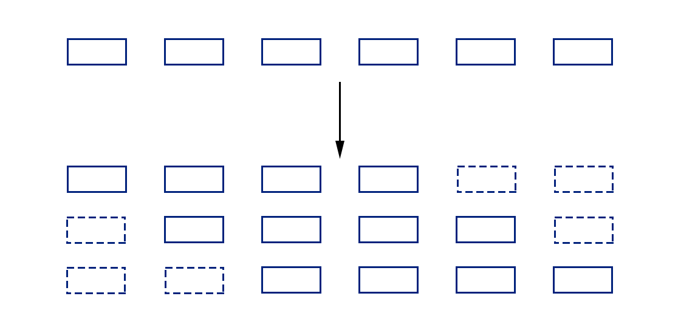
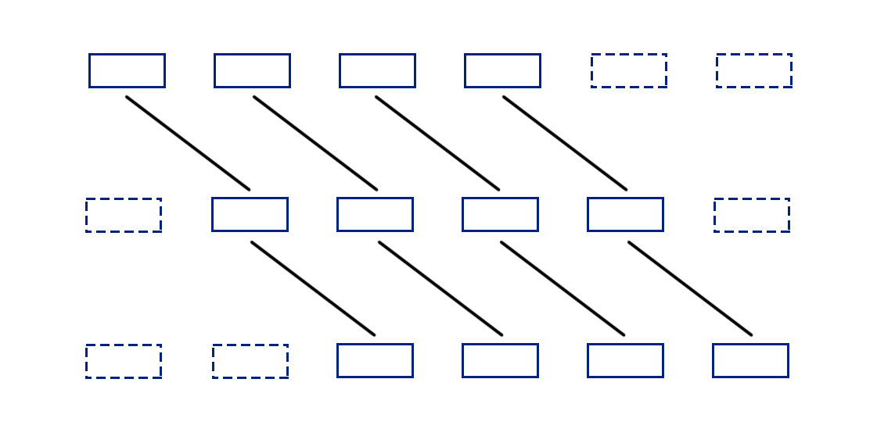

##基于RNN卷积核的Network in Network模型

​		和LeNet（传统CNN）相比，Network in Network模型用微型网络（MLP）作为卷积核，增强了卷积核提取非线性特征的能力（原始卷积核只能提取线性特征）。

​		本项目在Network in Network模型的基础上，针对自然语言领域中，位置信息对文本的重要性，而MLP并不能有效提取位置信息，因而尝试使用RNN替代MLP作为卷积核。与MLP相比，RNN可保留位置信息之余，因为卷积核本身尺寸较小，在卷积核中进行RNN运算可避免长期依赖问题，同时，卷积运算的特性也使得多个RNN可进行并行计算；

###RNN卷积核原理：

1. 以卷积核尺寸为3为例，假设下图每个方框表示一个词向量，首先根据不同的时刻对序列进行遮掩，生成三个子序列，假设序列有六个词，那么生成的每段序列有4个词：

2. 首先对第一段序列进行卷积运算，得到的输出和第二段序列进行线性变换后，再进行卷积运算，以此类推：

​		整个过程和RNN本质上是一样的，只是利用卷积核的特性，使得运算次数从序列长度（6）降低到卷积核尺寸（3）。

3. 线性变换采用大小为1的卷积核进行卷积运算，可大大减少参数量。